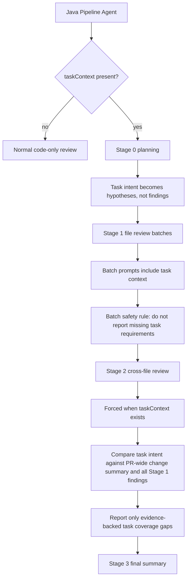

# CodeCrow Inference Orchestrator

A Python application for AI-powered code review using MCP (Model Context Protocol), structural repository context, and Lost-in-the-Middle protection.

---

## Table of Contents

- [Overview](#overview)
- [Architecture](#architecture)
- [Structural Repository Context Flow](#structural-repository-context-flow)
- [Task Context Flow](#task-context-flow)
- [Lost-in-the-Middle Protection](#lost-in-the-middle-protection)
- [Smart Chunking System](#smart-chunking-system)
- [Context Building Pipeline](#context-building-pipeline)
- [Token Budget Management](#token-budget-management)
- [Caching & Optimization](#caching--optimization)
- [Installation](#installation)
- [Configuration](#configuration)
- [API Reference](#api-reference)

---

## Overview

CodeCrow Inference Orchestrator is the core component responsible for:

- Receiving code review requests from the Pipeline Agent
- Extracting and analyzing Pull Request diffs
- Incorporating optional Jira/task-management context into PR-wide review
- Integrating exact structural repository context for code understanding
- Applying Lost-in-the-Middle protection for large PRs
- Orchestrating direct and agentic LLM review through one shared execution service

```
┌─────────────────────────────────────────────────────────────────────────────┐
│                         CodeCrow Inference Orchestrator                      │
├─────────────────────────────────────────────────────────────────────────────┤
│                                                                             │
│  ┌─────────────┐    ┌─────────────┐    ┌─────────────┐    ┌─────────────┐  │
│  │   FastAPI   │───▶│   Review    │───▶│   Context   │───▶│     LLM     │  │
│  │   Server    │    │   Service   │    │   Builder   │    │   (MCP)     │  │
│  └─────────────┘    └─────────────┘    └─────────────┘    └─────────────┘  │
│         │                 │                   │                   │         │
│         │                 │                   │                   │         │
│         ▼                 ▼                   ▼                   ▼         │
│  ┌─────────────┐    ┌─────────────┐    ┌─────────────┐    ┌─────────────┐  │
│  │    RAG      │    │    File     │    │   Smart     │    │   Response  │  │
│  │   Client    │    │ Classifier  │    │  Chunker    │    │   Parser    │  │
│  └─────────────┘    └─────────────┘    └─────────────┘    └─────────────┘  │
│                                                                             │
└─────────────────────────────────────────────────────────────────────────────┘
```

---

## Architecture

### Project Structure

```
inference-orchestrator/
├── main.py                    # Application entry point
├── model/
│   └── models.py              # Pydantic data models
├── llm/
│   └── llm_factory.py         # LLM provider factory
├── server/
│   ├── mcp_config.py          # MCP server configuration
│   └── web_server.py          # FastAPI HTTP server
├── service/
│   ├── review_service.py      # Core review orchestration
│   └── rag_client.py          # Structural repository-index client
├── utils/
│   ├── prompt_builder.py      # Prompt generation with L-i-M protection
│   ├── response_parser.py     # JSON response extraction
│   ├── file_classifier.py     # Neutral compatibility wrapper
│   └── diff_parser.py         # Unified diff parsing
└── requirements.txt
```

### Core Components

| Component        | Responsibility                                   |
| ---------------- | ------------------------------------------------ |
| `ReviewService`  | Orchestrates the entire review pipeline          |
| `RagClient`      | Structural indexing, deterministic context, and code search |
| `FileClassifier` | Neutral file-classification compatibility wrapper |
| `SmartChunker`   | Legacy neutral line/hunk chunking compatibility  |
| `PromptBuilder`  | Generates prompts with Lost-in-Middle protection |
| Shared agent execution service | Creates agent sessions from a prompt, allowed MCP tools, repository bindings, and review metadata |

### Stage 1 agent mode

The project `useMcpTools` analysis setting defaults to enabled. The Pipeline Agent
downloads the target-branch-head archive before inference and supplies a temporary
local repository binding. Every Stage 1 file-review prompt then runs through the
shared agent execution service with local file and VCS-compatible tools and
revision-bound RAG search. The prompt still contains its diff, current-source
projection, and preassembled structural RAG context; agent tools are additional
ways to investigate that evidence.

An explicit `false` uses the direct structured-model path. Disabling may reduce
cost and latency, but may reduce output quality. Archive staging and file, VCS,
and on-demand RAG tools are auxiliary. If snapshot staging fails, repository
navigation continues with revision-pinned provider reads. If on-demand RAG fails,
the agent retains repository tools and preassembled RAG. An MCP or agent execution
failure records reduced context and reruns that batch with an MCP-free direct
prompt containing the same assembled evidence.

---

## Structural Repository Context Flow

Reviews use revision-bound structural repository context. Stage 1 asks the
repository index for exact changed-file chunks, symbol definitions, imports,
inheritance, namespace relationships, and framework/plugin graph facts. The
request is bound to the target collection, base revision and generation
receipt; a successfully built PR overlay additionally binds the source revision,
PR generation fingerprint, and overlay receipt.

The returned chunks are filtered only for stale/deleted paths, exact duplicate
evidence, and current-source redundancy. Match
types and concrete `matched_on` values are included in the prompt. Only exact
structural matches are used.

This deterministic context remains in each Stage 1 prompt when agent mode is
enabled. The RAG MCP tool can add focused revision-bound results on demand; it
does not replace preassembly or make RAG a prerequisite for reviewing the diff.

Stage 2 does not issue another repository search. It combines changed source,
Stage 1 findings, exact architecture/enrichment data, plugin groups, migrations,
and task context.

`/codecrow ask` may use `POST /query/code-search` when the request supplies a
complete branch/revision/generation/collection binding. Results expose
`match_reasons`; internal ordering weights are not exposed as relevance or
confidence values. Missing bindings and search
failures skip this optional context while exact VCS MCP source tools remain
available.

```python
await rag_client.get_deterministic_context(
    workspace="my-org",
    project="my-repo",
    branches=["main"],
    file_paths=["src/auth/token.py"],
    base_revision="<commit>",
    base_generation_manifest_sha256="<receipt>",
    collection_target="<sealed-collection>",
)
```

## Task Context Flow

The Pipeline Agent may attach optional task-management context to a PR review
request under `taskContext` (or `task_context`). Jira is the current provider
used by CodeCrow task-management connections. This input is treated as untrusted
business context: prompts may use it to understand intent and acceptance
criteria, but never as instructions that override the review prompt.

Task context is controlled before the request reaches the orchestrator:

- Project config: `taskContextAnalysisEnabled` defaults to `true`.
- Disable it per project through analysis settings when task-aware review is not
  wanted.
- If disabled, no Jira/task-management lookup is attempted.
- If enabled but no unique connected task-management connection or task key is
  available, the analysis continues without `taskContext`.



### Why Task Coverage Runs After Batches

Stage 1 may split a PR into multiple LLM calls for token safety. A single batch
does not contain the full PR, so it must not claim that a Jira acceptance
criterion is missing. The orchestrator handles this in three places:

1. Stage 1 prompts include a batch-safety rule forbidding missing-task findings
   from one batch.
2. `should_run_stage_2()` forces Stage 2 whenever `taskContext` is present, even
   in fast-check mode.
3. Stage 2 receives the complete supplied full-PR state ledger, the current execution delta,
   architecture/plugin context and all Stage 1 findings before making
   task-coverage claims.

### Incremental Evidence Scopes

Incremental analysis does not send the whole PR through every review stage:

- Stage 0, Stage 1, PR-overlay/index work, hunk coverage, and new inline anchors
  use only `deltaDiff`.
- Stage 2 gets a locally assembled base-to-head ledger in addition to the delta.
- The ledger starts with a path manifest and then ranks task-relevant
  changed hunks without omitting lower-ranked evidence. It does not cause another source-retrieval or model
  call because `rawDiff` is already carried in the incremental request.
- If the supplied diff itself is incomplete, the ledger is marked `INCOMPLETE`;
  it is never shortened to satisfy an orchestrator character budget.

A new incremental task-coverage gap must cite a `DELTA###` excerpt that visibly
removes the task behavior. Generic or mislabelled "the PR does not implement the
task" candidates are suppressed by the host publication gate. Full-review
coverage claims require complete changed-line evidence and prompt-visible
`PRF###` references.

Successful task-aware reviews return positive evidence in the
machine-readable `taskEvidence` result field, separately from `comment`. The
Pipeline Agent validates and stores normalized evidence rows in the database
for prior same-task context in later PRs. PR and Jira comments contain only the
human-facing report and are never parsed as evidence storage. The records
contain task-relevant paths, hunk/line coordinates, and added-line excerpts—not
historical raw diffs or a model-authored completion claim.

### Request Shape

```json
{
  "projectId": 123,
  "projectWorkspace": "workspace",
  "projectNamespace": "payments",
  "projectVcsWorkspace": "org",
  "projectVcsRepoSlug": "repo",
  "pullRequestId": 456,
  "taskContext": {
    "task_key": "PAY-123",
    "task_summary": "Add refund export",
    "description": "Acceptance Criteria\n- Exports approved refunds",
    "status": "In Progress",
    "task_type": "Story",
    "priority": "High",
    "assignee": "dev@example.com",
    "reporter": "pm@example.com",
    "web_url": "https://jira.example/browse/PAY-123",
    "provider": "jira-cloud"
  }
}
```

---

## Lost-in-the-Middle Protection

Large Language Models often lose focus on content in the middle of long prompts. CodeCrow implements several strategies to combat this.

### The Problem

```
┌────────────────────────────────────────────────────────────┐
│           LLM Attention Distribution (Typical)             │
├────────────────────────────────────────────────────────────┤
│                                                            │
│  Attention                                                 │
│      ▲                                                     │
│  100%│  ████                                    ████       │
│      │  ████                                    ████       │
│   75%│  ████                                    ████       │
│      │  ████    ░░░░░░░░░░░░░░░░░░░░░░░░░░     ████       │
│   50%│  ████    ░░░░░░░░░░░░░░░░░░░░░░░░░░     ████       │
│      │  ████    ░░░░░░░░░░░░░░░░░░░░░░░░░░     ████       │
│   25%│  ████    ░░░░░░░░░░░░░░░░░░░░░░░░░░     ████       │
│      │  ████    ░░░░░░░░░░░░░░░░░░░░░░░░░░     ████       │
│    0%└──────────────────────────────────────────────▶      │
│         START   ◀── LOST ZONE ──▶              END        │
│                                                            │
│  Problem: Critical code in middle gets less attention!     │
└────────────────────────────────────────────────────────────┘
```

### Solution: Evidence-Preserving Structuring

```
┌────────────────────────────────────────────────────────────┐
│           CodeCrow Context Structure                       │
├────────────────────────────────────────────────────────────┤
│                                                            │
│  ┌──────────────────────────────────────────────────────┐  │
│  │  ████ SYSTEM PROMPT + REVIEW RULES ████              │  │
│  │  "Use all provided evidence; avoid path assumptions"  │  │
│  └──────────────────────────────────────────────────────┘  │
│                          │                                 │
│                          ▼                                 │
│  ┌──────────────────────────────────────────────────────┐  │
│  │  ████ CHANGED DIFF EVIDENCE ████                     │  │
│  │  All changed files or hunk-preserving segments        │  │
│  └──────────────────────────────────────────────────────┘  │
│                          │                                 │
│                          ▼                                 │
│  ┌──────────────────────────────────────────────────────┐  │
│  │  ░░░░ STRUCTURED PARSER METADATA ░░░░                │  │
│  │  Imports, symbols, calls, relationships as data       │  │
│  └──────────────────────────────────────────────────────┘  │
│                          │                                 │
│                          ▼                                 │
│  ┌──────────────────────────────────────────────────────┐  │
│  │  ░░░░ PR-WIDE CONTEXT ░░░░                           │  │
│  │  Task context, changed-file list, previous issues     │  │
│  └──────────────────────────────────────────────────────┘  │
│                          │                                 │
│                          ▼                                 │
│  ┌──────────────────────────────────────────────────────┐  │
│  │  ████ STRUCTURAL CONTEXT ████                        │  │
│  │  Repository context with stale PR data protection     │  │
│  └──────────────────────────────────────────────────────┘  │
│                                                            │
└────────────────────────────────────────────────────────────┘
```

### L-i-M Instructions in Prompt

```python
LOST_IN_MIDDLE_INSTRUCTIONS = """
## CRITICAL: Context Processing Instructions

This code review contains STRUCTURED CONTEXT organized by evidence source.
You MUST process all sections without assuming that a filename, extension, or
directory label determines risk.

1. **DIFF EVIDENCE**
   - Changed lines and hunk context.

2. **STRUCTURED METADATA**
   - Parser output and dependency relationships.

3. **PR-WIDE CONTEXT**
   - Task intent, changed-file list, previous issues.

4. **STRUCTURAL REPOSITORY CONTEXT**
   - Repository context. Prefer PR-indexed chunks for changed files.
   - File identity is exact or a multi-segment repository-relative suffix.
     Basenames are never identities, so repeated framework paths such as
     module-local `etc/di.xml` files remain independent.

⚠️ DO NOT skip middle sections. Each section contains unique issues.
"""
```

---

## Neutral Chunking Compatibility

`SmartChunker` remains only as a compatibility utility. It does not detect
language by extension, parse imports, classify declarations, or prioritize
chunks by code construct. Large plain text is split by line budget. Large diffs
are split by hunk budget so raw diff evidence remains intact for the LLM.

### Diff Chunking

For large diffs, hunks are kept together without classifying their contents:

```diff
# Original diff with 10 hunks

@@ -10,7 +10,7 @@ ...      ← Hunk 1
@@ -50,12 +50,15 @@ ...     ← Hunk 2
...
@@ -500,8 +510,8 @@ ...    ← Hunk 10

# SmartChunker groups hunks by token budget:
# Chunk 1: File header + Hunks 1-4
# Chunk 2: File header + Hunks 5-7
# Chunk 3: File header + Hunks 8-10
```

---

## Context Building Pipeline

### File Classification

The active review pipeline does not classify files by hardcoded path patterns.
Planning receives changed-file summaries, structured parser metadata, task
context, and relationship data, then the LLM decides review priority from that
evidence. The legacy `FileClassifier` module remains as a neutral compatibility
wrapper for older imports; it does not skip or demote paths by filename.

### Context Assembly

````python
# Stage prompts are assembled from evidence sections:
stage_1_prompt = {
    "current_file_content": "complete post-change source or complete hunk-centered windows fetched at the analyzed commit",
    "diff_evidence": "changed hunks or hunk-preserving large-diff segment",
    "structured_parser_metadata": "raw parser metadata JSON",
    "task_context": "untrusted task/acceptance criteria text",
    "rag_context": "repository context with stale changed-file protection",
}

# Python does not infer file priority or risk from path/extension/category.
# The LLM receives evidence and decides what matters.
````

---

## Token Budget Management

Stage 1 keeps structurally related files together while the combined diff fits
the model budget. Large file diffs are split into hunk-preserving segments only
when the evidence itself exceeds that budget.

### Evidence Distribution

```
┌────────────────────────────────────────────────────────────┐
│             Stage Prompt Evidence Sections                 │
├────────────────────────────────────────────────────────────┤
│                                                            │
│  ┌────────────────────────────────────────────────────┐    │
│  │  CURRENT FILE CONTENT (POST-CHANGE)                │    │
│  └────────────────────────────────────────────────────┘    │
│                                                            │
│  ┌────────────────────────────────────────────────────┐    │
│  │  DIFF EVIDENCE                                     │    │
│  └────────────────────────────────────────────────────┘    │
│                                                            │
│  ┌────────────────────────────────────────────────────┐    │
│  │  STRUCTURED PARSER METADATA                        │    │
│  └────────────────────────────────────────────────────┘    │
│                                                            │
│  ┌────────────────────────────────────────────────────┐    │
│  │  TASK / PR-WIDE CONTEXT                            │    │
│  └────────────────────────────────────────────────────┘    │
│                                                            │
│  ┌────────────────────────────────────────────────────┐    │
│  │  STRUCTURAL REPOSITORY CONTEXT                    │    │
│  └────────────────────────────────────────────────────┘    │
│                                                            │
└────────────────────────────────────────────────────────────┘
```

### Dynamic Adjustment

Stage 1 batch size is controlled by environment settings such as
`REVIEW_STAGE1_BATCH_TOKEN_BUDGET`, `REVIEW_STAGE1_DIFF_CHUNK_TOKEN_BUDGET`,
`REVIEW_STAGE1_MAX_PARALLEL`, and the source/metadata/RAG character limits.
Complete changed hunks remain primary evidence. When the selected review-size
profile reaches its Stage 1 invocation ceiling, lower-priority units are recorded
as `budget_omitted`; omitted hunk/unit/context counts are carried into terminal
coverage and are not interpreted as negative evidence.

Normal review stages do not add a CodeCrow-generated output/completion cap.
Provider-native context or completion limits still apply, and a provider adapter
may supply a limit when its API requires one. Input packing remains independent
of generated output: it keeps complete evidence records within each request's
available context window.

Primary semantic invocation ceilings are also size-specific: Stage 1 total
4/12/24 with at most 1/2/3 units for one hunk-owned item, Stage 2 1/2/4 packets,
Stage 3 1/2/4 child calls plus at most one final synthesis, and branch
reconciliation 1/2/4 packets. Structured primary calls retain the stage's
configured reasoning effort. When a response is exhausted or invalid, a stage
that supports retry may make one direct-output retry with reasoning disabled.
Packet/shard omission counts are prompt-visible and preserved in provenance.
When MCP tools are enabled, a Stage 1 agent can add tool and model turns inside a
primary invocation; disabling the setting avoids that conditional work.

PR overlay indexing is awaited before Stage 1 so changed-file structural
context cannot silently come from the base branch. Exact source, base,
generation, collection, plugin, and representation receipts determine whether
the overlay can be reused. Optional structural retrieval failures disable
repository context for the remaining batches and the review continues with
changed source, diff evidence, enrichment, and plugin context.

| Variable | Default | Purpose |
| -------- | ------: | ------- |
| `REVIEW_PR_INDEX_TIMEOUT_SECONDS` | 1200 | Maximum PR overlay indexing wait |

Final issue deduplication begins with exact local root identities and uses grouped
model-assisted dedup by default (`REVIEW_LLM_DEDUP_ENABLED=true`). The host sends only
ambiguous candidate components; unrelated singletons consume no dedup tokens.
The model returns explicit duplicate groups, and only `HIGH`-confidence decisions
inside one host-selected component can merge findings. Omitted, uncertain,
malformed, or failed decisions retain all ambiguous findings. Category or
severity drift does not split a proven root cause. Cross-file consolidation is
allowed only for one shared causal defect and retains every secondary `file:line`
in the finding's reason and `relatedLocations`.

Candidate components use the shared 60k estimated-input target and the request's
model-context value with a generation reserve. Whole candidate groups are packed
without field-level clipping. If one indivisible group cannot fit, no oversized
request is sent and every finding in that group is retained.
`REVIEW_DEDUP_MAX_PARALLEL=4` limits candidate batches within one review and does
not serialize concurrently admitted reviews. Set `REVIEW_LLM_DEDUP_ENABLED=false`
to use exact local merging only.

The Java persistence boundary adds an exact same-file substantive-title/reason
safety net before its exact category-aware and category-agnostic anchored
fingerprints. It retains the strongest source anchor, highest severity, best
valid fix, and additional concrete locations. Short boilerplate, sharing only a
file/line/category/FILE scope, and placeholder fingerprints without an actual
anchor cannot suppress another finding. These Java checks add no model calls.

Full-pipeline prompt dry runs forward the normal Stage 0–3 progress events and
persist a compact `review_evidence_completed` record with terminal hunk counts,
registered/completed review-unit counts, deterministic retrieval states, and
exact evidence counts. The artifact also binds those diagnostics to the target
and source branches, immutable head/base object IDs, changed/deleted manifests,
and raw-diff digest. Review-scoped plugin diagnostics are captured without
cross-talk between concurrent reviews. `tools.review_quality.prompt_dry_run_audit`
fails closed when any general pipeline stage, exact coverage state, retrieval
state, plugin diagnostic, prompt budget, or review-provider guard is missing.
Review-scoped assembly diagnostics record per-batch character allocations for
diff, current source, AST metadata, structural context, plugin context, project rules, task
context, and prior issues; they add nothing to the prompt itself. These
diagnostics do not add model calls and are not precision/recall measurements.

Queued review progress is serialized in callback order, and the consumer awaits
the single terminal publication after all Stage 0–3 events. While any normal or
provider-free review is active it emits `state=processing` every
`ANALYSIS_QUEUE_HEARTBEAT_SECONDS` (default 30). The Java producer uses
`ANALYSIS_QUEUE_INACTIVITY_TIMEOUT_MINUTES` (default 15) as a silence deadline,
not a total-runtime limit, and renews the PR analysis lock on those liveness
events. Missing/expired ownership or a renewal exception fails the review before
persistence or VCS reporting.

Provider webhook commit abbreviations never become review identity. The Java
producer accepts only an exact full object ID or a matching prefix of at least
12 characters as an acquisition hint, fetches full base/head IDs from the VCS
PR endpoint, and replaces the hint before persistence, RAG, or this service.
Malformed provider IDs and stale/mismatched hints fail before model work.

Actual candidate-generation evidence is available through an operator-only,
project-scoped capture wrapper. `REVIEW_QUALITY_CAPTURE_ENABLED=true` also
requires a non-empty numeric `REVIEW_QUALITY_CAPTURE_PROJECT_IDS` allowlist.
The wrapper records the sanitized immutable request, exact model inputs,
schemas/tools, actual responses, usage metadata, and final result under
`REVIEW_QUALITY_CAPTURE_OUTPUT_DIR` (default
`/app/logs/review-quality-captures`). It observes the existing BYOK calls and
does not add or retry them. Artifacts contain proprietary source/context and use
mode `0600`; credential values are redacted. `REVIEW_QUALITY_CAPTURE_MAX_FILES`
defaults to 20. Initialization or atomic persistence failure fails the selected
review closed so an incomplete artifact cannot be mistaken for complete quality
evidence.

---

## Installation

### Requirements

- Python 3.10+
- Structural repository-index service running (optional enrichment)
- MCP Server JAR file

### Setup

```bash
# Install dependencies
pip install -r requirements.txt

# Development/test environment (includes the runtime requirements)
pip install -r requirements.test.txt

# Configure environment
cp .env.sample .env
# Edit .env with your settings
```

---

## Configuration

### Environment Variables

```bash
# Server Configuration
AI_CLIENT_HOST="0.0.0.0"
AI_CLIENT_PORT="8000"

# MCP Server
MCP_SERVER_JAR="/path/to/mcp-server.jar"

# LLM tuning (provider credentials are supplied with each Java request)
LLM_TEMPERATURE="0.0"

# Structural repository index
RAG_ENABLED="true"
RAG_API_URL="http://rag-pipeline:8001"
```

---

## API Reference

### POST /review

Submit a code review request.

**Request:**

```json
{
  "projectId": 123,
  "projectWorkspace": "workspace",
  "projectRepoSlug": "repo-name",
  "aiProvider": "openrouter",
  "aiModel": "anthropic/claude-3-5-sonnet",
  "aiApiKey": "your-api-key",
  "pullRequestId": 456,
  "taskContext": {
    "task_key": "PAY-123",
    "task_summary": "Add refund export",
    "description": "Acceptance Criteria\n- Exports approved refunds"
  },
  "ragEnabled": true
}
```

**Response:**

```json
{
  "result": {
    "comment": "Review summary with findings...",
    "issues": {
      "0": {
        "severity": "HIGH",
        "file": "src/auth/service.py",
        "line": "42",
        "reason": "SQL injection vulnerability in user query",
        "suggestedFix": "Use parameterized queries..."
      }
    }
  },
  "error": null
}
```

### GET /health

Health check endpoint.

**Response:**

```json
{
  "status": "healthy",
  "rag_enabled": true,
  "rag_healthy": true
}
```

---

## Related Documentation

- [RAG Pipeline Documentation](../rag-pipeline/README.md)
- [MCP Scaling Strategy](../../docs/architecture/mcp-scaling-strategy.md)
- [Integration Guide](../rag-pipeline/docs/INTEGRATION_GUIDE.md)
